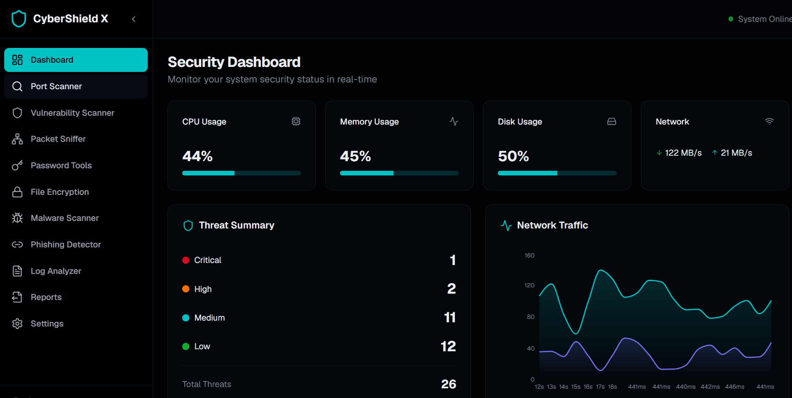
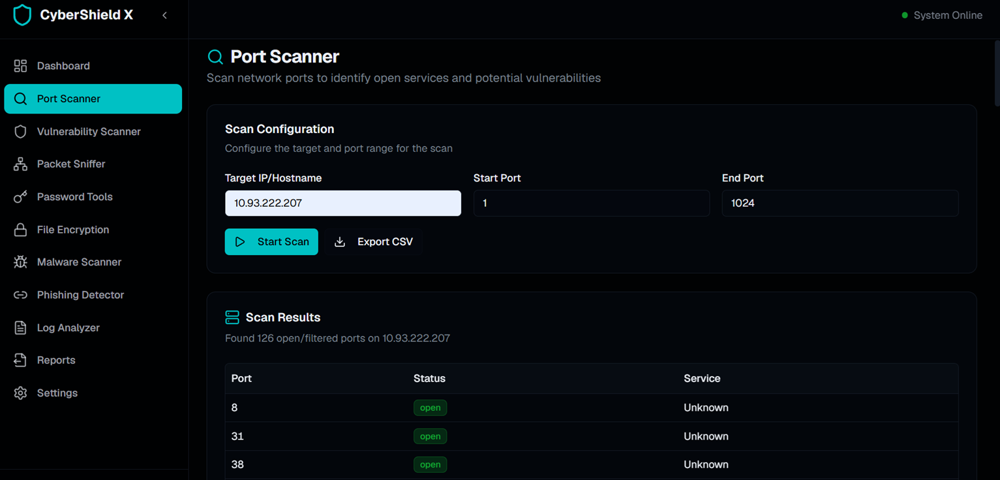
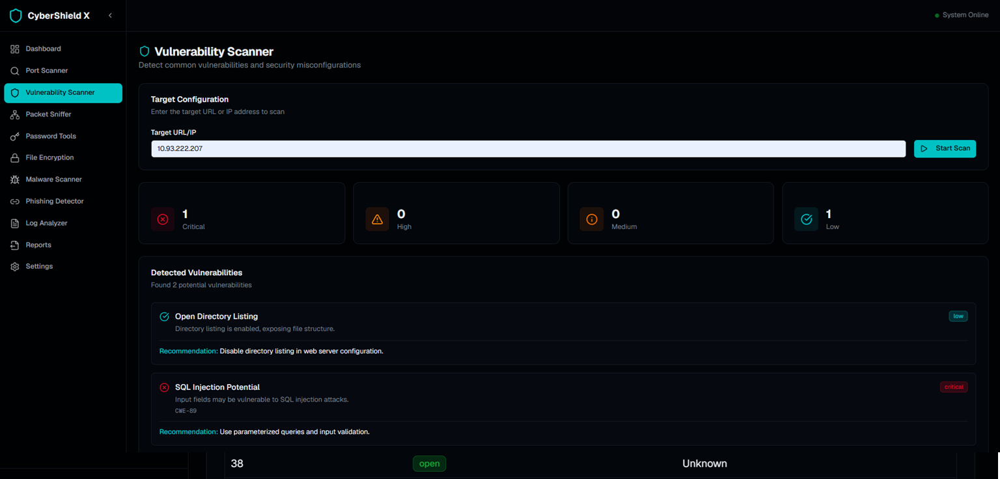
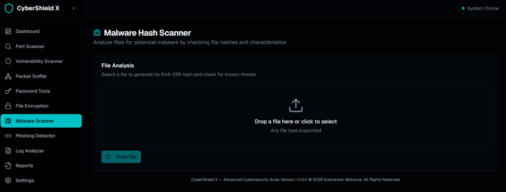
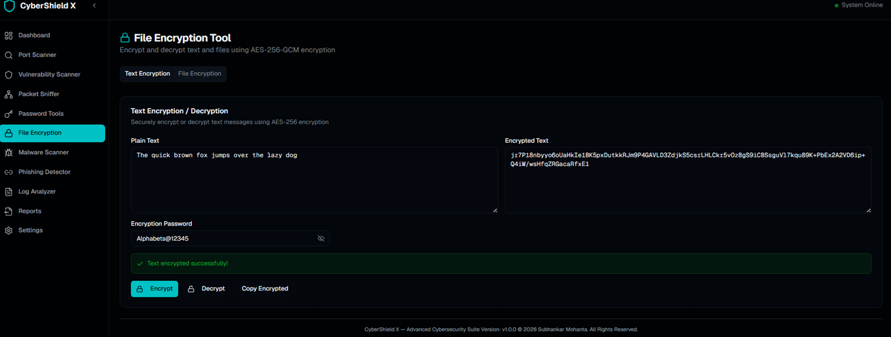
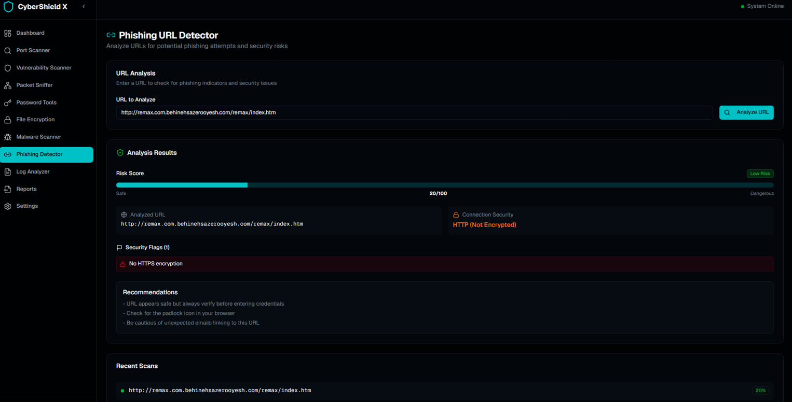

# 🛡️ CyberShield X

<div align="center">


Advanced SOC-Style Cybersecurity Dashboard & Security Toolkit

</div>

---

# 📌 Overview

CyberShield X is an advanced cybersecurity dashboard built using **Next.js 16**, **TypeScript**, and **Tailwind CSS** with a modern cyberpunk SOC (Security Operations Center) UI.

The platform provides multiple integrated security tools including:

- 🔍 Vulnerability Scanner
- 🌐 Port Scanner
- 📡 Packet Sniffer
- 🔐 AES-256 Encryption
- 🔑 Password Protector
- ☣️ Malware Scanner
- 🎣 Phishing Detector
- 📊 Log Analyzer
- 📈 Reports Dashboard
- 👤 Secure Authentication System

---

# ✨ Features

## 🖥️ SOC Dashboard

- Real-time security dashboard
- Threat monitoring system
- Security statistics visualization
- Activity logs and alerts
- Responsive cyberpunk UI

---

## 🌐 Port Scanner

- IP & Port range scanning
- Open/Closed port detection
- Service identification
- Real-time scanning progress

---

## 🔍 Vulnerability Scanner

- Detects security vulnerabilities
- SSL/TLS analysis
- XSS & SQL Injection checks
- CVE-style threat reporting

---

## 📡 Packet Sniffer

- Live traffic simulation
- TCP/UDP/DNS/HTTP monitoring
- Protocol filtering
- Auto-refresh logs

---

## 🔐 Password Tools

- Secure password generator
- Password strength analyzer
- Entropy calculation
- Crack-time estimation

---

## 🔒 AES-256 Encryption

- AES-256-GCM encryption
- Secure text/file encryption
- Web Crypto API integration
- Password-based key derivation

---

## ☣️ Malware Scanner

- SHA-256 file hash generation
- Threat classification
- Risk scoring system
- Simulated malware detection

---

## 🎣 Phishing Detector

- URL threat analysis
- Typosquatting detection
- Suspicious TLD detection
- Risk scoring engine

---

## 📊 Log Analyzer

- Security log parsing
- Threat pattern detection
- Failed login monitoring
- SQL Injection & XSS detection

---

## 📈 Reports & Analytics

- Scan history management
- Threat visualization
- Report generation
- Export support

---

## 👤 Authentication System

- Secure login system
- SHA-256 password hashing
- Protected routes
- Session management

---

# 🛠️ Tech Stack

| Technology | Usage |
|---|---|
| Next.js 16 | Frontend Framework |
| TypeScript | Type Safety |
| Tailwind CSS | Styling |
| shadcn/ui | UI Components |
| Recharts | Data Visualization |
| Lucide React | Icons |
| Web Crypto API | Encryption |
| React Hook Form | Form Handling |
| Zod | Validation |

---

# 📂 Project Structure

```bash
CyberShieldX/
│
├── app/
│   ├── globals.css
│   ├── layout.tsx
│   ├── page.tsx                              # Login Page
│   │
│   ├── dashboard/
│   │   ├── page.tsx                          # Main Dashboard
│   │   ├── encryption/
│   │   │   └── page.tsx
│   │   ├── log-analyzer/
│   │   │   └── page.tsx
│   │   ├── malware-scanner/
│   │   │   └── page.tsx
│   │   ├── packet-sniffer/
│   │   │   └── page.tsx
│   │   ├── password-tools/
│   │   │   └── page.tsx
│   │   ├── phishing-detector/
│   │   │   └── page.tsx
│   │   ├── port-scanner/
│   │   │   └── page.tsx
│   │   ├── reports/
│   │   │   └── page.tsx
│   │   ├── settings/
│   │   │   └── page.tsx
│   │   └── vulnerability-scanner/
│   │       └── page.tsx
│
├── components/
│   ├── auth/
│   │   └── login-form.tsx
│   │
│   ├── dashboard/
│   │   └── dashboard-content.tsx
│   │
│   ├── layout/
│   │   └── dashboard-layout.tsx
│   │
│   ├── security/
│   │   ├── encryption.tsx
│   │   ├── log-analyzer.tsx
│   │   ├── malware-scanner.tsx
│   │   ├── packet-sniffer.tsx
│   │   ├── password-tools.tsx
│   │   ├── phishing-detector.tsx
│   │   ├── port-scanner.tsx
│   │   ├── reports.tsx
│   │   ├── settings.tsx
│   │   └── vulnerability-scanner.tsx
│   │
│   ├── ui/                                   # shadcn/ui Components
│   │   ├── badge.tsx
│   │   ├── button.tsx
│   │   ├── card.tsx
│   │   ├── chart.tsx
│   │   ├── input.tsx
│   │   ├── progress.tsx
│   │   ├── scroll-area.tsx
│   │   ├── select.tsx
│   │   ├── slider.tsx
│   │   ├── switch.tsx
│   │   ├── tabs.tsx
│   │   └── ...
│   │
│   └── theme-provider.tsx
│
├── hooks/
│   ├── use-mobile.ts
│   └── use-toast.ts
│
├── lib/
│   ├── auth-context.tsx
│   ├── scan-store.ts
│   ├── security-tools.ts
│   └── utils.ts
│
├── public/
│   ├── screenshots/
│   │   ├── dashboard.png
│   │   ├── login.png
│   │   ├── port-scanner.png
│   │   └── vulnerability-scanner.png
│   │
│   └── assets/
│
├── screenshots/
│   └── dashboard.png
│
├── package.json
├── package-lock.json
├── tsconfig.json
├── next.config.mjs
├── postcss.config.mjs
├── tailwind.config.ts
├── middleware.ts
├── README.md
├── LICENSE
└── .gitignore
```

---

# ⚙️ Installation Guide

## 1️⃣ Clone Repository

```bash
git clone https://github.com/subhankar505s/CyberShieldX.git
```

---

## 2️⃣ Navigate Into Project

```bash
cd CyberShieldX
```

---

## 3️⃣ Install Dependencies

```bash
npm install
```

---

## 4️⃣ Install Required Packages

```bash
npm install next react react-dom
```

---

## 5️⃣ Install UI & Utility Libraries

```bash
npm install lucide-react recharts sonner zod react-hook-form @hookform/resolvers clsx tailwind-merge class-variance-authority
```

---

## 6️⃣ Install Radix UI Components

```bash
npm install @radix-ui/react-tabs @radix-ui/react-select @radix-ui/react-switch @radix-ui/react-slider @radix-ui/react-scroll-area
```

---

## 7️⃣ Install Tailwind CSS

```bash
npm install tailwindcss @tailwindcss/postcss postcss
```

---

# ▶️ Running The Project

## Start Development Server

```bash
npm run dev
```

---

# 🌐 Open In Browser

```bash
http://localhost:3000
```

---

# 🔑 Default Login Credentials

```bash
Username: admin
Password: admin123
```

---

# 🎨 UI Theme

| Element | Color |
|---|---|
| Background | #0a0a0f |
| Surface | #12121a |
| Primary Accent | #00d4ff |
| Secondary Accent | #7c3aed |
| Success | #22c55e |
| Warning | #f59e0b |
| Danger | #ef4444 |

---

# 🔐 Security Features

- AES-256-GCM Encryption
- SHA-256 Password Hashing
- Security Threat Detection
- Real-Time Monitoring
- Protected Routes
- Threat Severity Analysis

---

# 🚀 Future Improvements

- AI Threat Detection
- Real Packet Capture
- Live CVE Feed
- Threat Intelligence Integration
- SIEM Dashboard
- Docker Deployment
- Real Malware Analysis
- API Security Scanner

---

# 📸 Screenshots

## DASHBOARD

<p align="center">
  
</p>

## PORT SCANNER

<p align="center">
  
</p>

## VULNERABILITY SCANNER

<p align="center">
  
</p>

## MALWARE HASH SCANNER

<p align="center">
  
</p>

## FILE & TEXT ENCRYPTION

<p align="center">
  
</p>


## PHISHING URL DETECTOR

<p align="center">
  
</p>
---

# 🧠 Resume Description

Developed **CyberShield X**, an advanced SOC-style cybersecurity dashboard using Next.js, TypeScript, Tailwind CSS, and shadcn/ui with integrated tools for vulnerability scanning, encryption, malware detection, phishing analysis, packet monitoring, and log analysis.

Implemented secure authentication, AES-256 encryption, real-time security monitoring, threat visualization, reporting system, and modular enterprise-grade cybersecurity architecture.

---

# 👨‍💻 Developer

<div align="center">

## Subhankar Mohanta

Cybersecurity Enthusiast • Full Stack Developer • SOC Dashboard Developer

© 2026 CyberShield X v1.0.0  
Designed & Developed by Subhankar Mohanta

</div>

---

# ⭐ Support

If you like this project, give it a ⭐ on GitHub.

```bash
⭐ Star The Repository
🍴 Fork The Project
🛡️ Build Secure Systems
```

---
